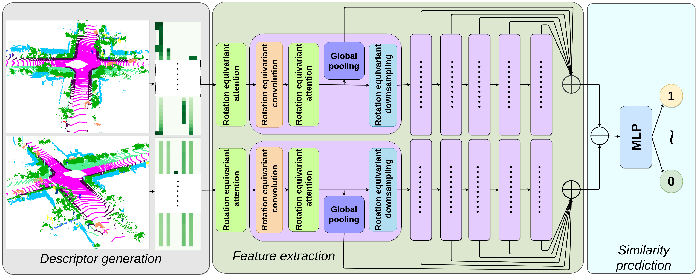

# RINet
Code for RA-L 2022 paper [RINet: Efficient 3D Lidar-Based Place Recognition Using Rotation Invariant Neural Network](https://ieeexplore.ieee.org/document/9712221)



## Citation

```
@ARTICLE{9712221,
  author={Li, Lin and Kong, Xin and Zhao, Xiangrui and Huang, Tianxin and Li, Wanlong and Wen, Feng and Zhang, Hongbo and Liu, Yong},
  journal={IEEE Robotics and Automation Letters}, 
  title={{RINet: Efficient 3D Lidar-Based Place Recognition Using Rotation Invariant Neural Network}}, 
  year={2022},
  volume={7},
  number={2},
  pages={4321-4328},
  doi={10.1109/LRA.2022.3150499}}
```

## Environment
### Conda
```
conda create -n rinet python=3.7
conda activate rinet
conda install pytorch torchvision torchaudio cudatoolkit=11.1 -c pytorch -c nvidia
conda install tqdm scikit-learn matplotlib tensorboard
```

## Usage
### Preprocessing
You can directly use the [descriptors we provide](https://drive.google.com/file/d/1Do36bYZ_LBM209WYvXc_WCOBzrLI7uYu/view?usp=sharing), or you can generate descriptors by yourself according to the descriptions below:       
 Requirements: [OpenCV](https://opencv.org/), [PCL](https://pointclouds.org/) and [yaml-cpp](https://github.com/jbeder/yaml-cpp).
 ```
 cd gen_desc && mkdir build && cd build && cmake .. && make -j4
 ```
 If the compilation is successful, then execute the following command to generate the descriptors (All descriptors will be saved to a single binary file "output_file.bin"):

 ```
 ./kitti_gen cloud_folder label_folder output_file.bin
 ```
### Training
#### Data structure
```
data
    |---desc_kitti
    |       |---00.npy
    |       |---01.npy
    |       |---....
    |---gt_kitti
    |       |---00.npz
    |       |---01.npz
    |       |---...
    |---pose_kitti
    |       |---00.txt
    |       |---02.txt
    |       |--...
    |---pairs_kitti
    |       |...
```
You can download the [provided preprocessed data](https://drive.google.com/file/d/1Do36bYZ_LBM209WYvXc_WCOBzrLI7uYu/view?usp=sharing).

#### Training model
```
python train.py --seq='00'
```

### Testing
Pretrained models can be downloaded from this [link](https://drive.google.com/file/d/1pjoTRlenQJUCDJevMgQsELaL_FbRdPXo/view?usp=sharing).
```
python eval.py
```

## Raw Data
We provide the [raw data](https://drive.google.com/file/d/1N19ZYVKoOvVzrTxiokl6oSR-pEezVPZJ/view?usp=sharing) of the tables and curves in the paper, including compared methods DiSCO and Locus. Raw data for other methods can be found in this [repository](https://github.com/lilin-hitcrt/SSC).
